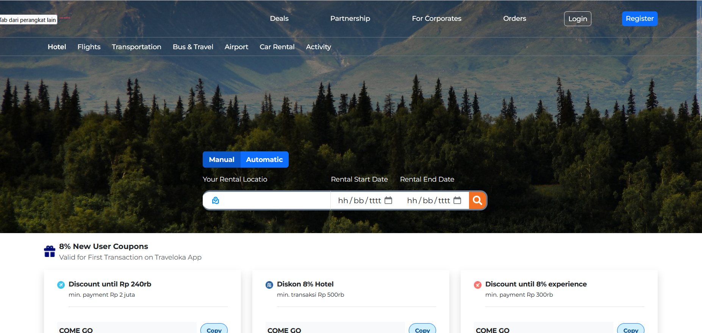

# Car Rental Frontend

A modern and responsive frontend for a car rental system, built with React and Vite. This project provides a user-friendly interface for browsing cars, managing bookings, user authentication, and integrating with the Car Rental Backend API.

## Table of Contents

- [Features](#features)
- [Tech Stack](#tech-stack)
- [Prerequisites](#prerequisites)
- [Installation](#installation)
- [Running the Application](#running-the-application)

## Features

- **User Authentication**: Login and registration pages integrated with the backend API.
- **Car Browsing**: View available cars with filters and details.
- **Booking Management**: Create and view rental bookings.
- **Responsive Design**: Optimized for both desktop and mobile devices.
- **API Integration**: Seamless communication with the Car Rental Backend API.

## Tech Stack

- **Framework**: React
- **Build Tool**: Vite
- **Styling**: CSS (Bootstrap)
- **State Management**: React Context or Redux
- **HTTP Client**: Axios
- **Routing**: React Router DOM
- **Others**: ESLint, Prettier

## Prerequisites

Ensure you have the following installed:

- [Node.js](https://nodejs.org/) (v16 or higher)
- [Git](https://git-scm.com/)

## Installation

1. Clone the repository:
   ```bash
   git clone https://github.com/setyawandwiki/car-rental-fe.git
   cd car-rental-fe
   ```
2. Install dependencies:
   ```bash
   npm install
   ```
3. npm run dev



# React + Vite

This template provides a minimal setup to get React working in Vite with HMR and some ESLint rules.

Currently, two official plugins are available:

- [@vitejs/plugin-react](https://github.com/vitejs/vite-plugin-react/blob/main/packages/plugin-react) uses [Babel](https://babeljs.io/) for Fast Refresh
- [@vitejs/plugin-react-swc](https://github.com/vitejs/vite-plugin-react/blob/main/packages/plugin-react-swc) uses [SWC](https://swc.rs/) for Fast Refresh

## Expanding the ESLint configuration

If you are developing a production application, we recommend using TypeScript with type-aware lint rules enabled. Check out the [TS template](https://github.com/vitejs/vite/tree/main/packages/create-vite/template-react-ts) for information on how to integrate TypeScript and [`typescript-eslint`](https://typescript-eslint.io) in your project.
